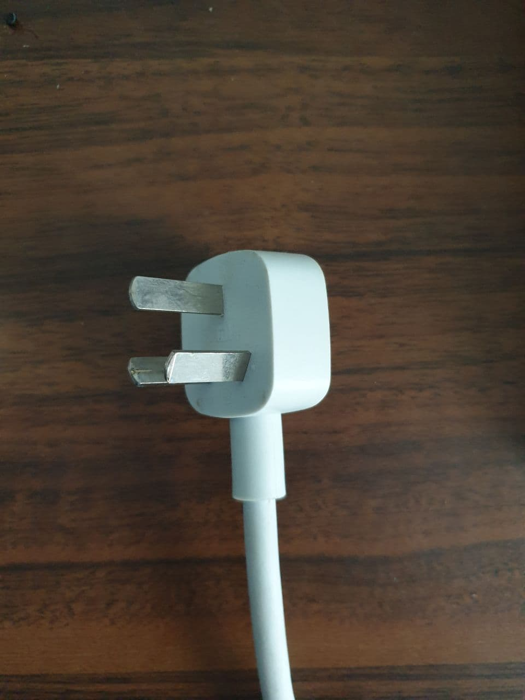

# Adapter Pattern

## Khái niệm

Adapter Pattern là một Design Pattern thuộc nhóm cấu trúc, cho phép các đối tượng (object) có interface không tương thích với nhau có thể làm việc cùng nhau.

Adapter Pattern giữ vài cho làm câu nối giữa hai lớp, giúp chuyển đổi interface của một hoặc nhiều lớp thành một interface khác. Điều này giúp ta không cần sữa lớp có sẵn hoặc lớp đang viết.

## Đặt vấn đề

Ví dụ thực tế: Ta có một ổ cấm âm tường với đầu vào là hai chấu âm dương tới nay hoạt động tốt với các thiết bị trong nhà.


Đến một ngày đẹp trời, ta mua thêm một máy hàn thiết với phích cắm 3 chân, theo tiêu chuẩn của Trung Quốc.



## Giải pháp

Vấn đề đặt ra làm sao để hai cái kết nối với nhau.

Bạn không thể đập tường của mình ra thay lại ổ cấm khác, vì điều này khá tốn kém và không tương thích với các loại ổ cấm củ.

Bạn cũng không thể sữa lại phích của máy hàn. Vì nó quá phức tạp hoặc không có sự cho phép của hảng sản xuất.

Giải pháp tốt nhất hiện tại là sử dụng adapter chuyên chân 3 chấu thành hai chấu, vừa giữa nguyên phích ba chấu của nhà sản xuất, vừa giữa nguyên ổ hai chấu âm tường của nhà. Ít tốn kém và giữa được sự tương thích với các ổ cấm cũ.


## Cấu Trúc

Adapter Pattern gồm các thành phần sau:

- Adapter: Đây là lớp tích hợp, giúp interface không tương thích được tích hợp với interface đang làm việc. Cụ thể thực hiện kết nối interface service với adaptee và kết nối adaptee với interface client.
- Client: đây là lớp chưa các phương thức logic của đối tượng.
- Client Interface: cung cấp phương nhất định mà các lớp khác phải tuân thủ để có thể giao tiếp với đối tượng.
- Service: Đây có thể là lớp nào đó hoặc môt thư viện thứ 3. Đối tượng Client không thể sử dụng được do interface của hai lớp khác biệt.
- Adaptee: Xác định interface không tương thích, cần được tích hợp (Service).

## Ví dụ áp dụng Adapter Pattern

Một người muốn sử dụng đèn led, với hiệu điện thế 3v. Tuy nhiên, người này đang dùng mạng lưới Việt Nam với hiệu điện thế 220v.

- Hiệu điện thế lớn hơn 3v bóng đèn sẽ cháy.
- Hiệu điện thế nhỏ hơn 3v bóng sáng mờ hoặc không phát sáng (Trong trường hợp này ta quy ước nó không phát sáng).
- Hiệu điện thế bằng 3v bóng đèn phát sáng

Như vậy ta cần một adapter chuyển từ 220v sáng 3v. Mô hình thể hiện như sau:


LedInterFace.java

```java
public interface LedInterFace {
    int connect();
}
```

VietNamPower.java

```java
public class VietNamPower {

    private int electric = 220;

    public int getElectric() {
        return this.electric;
    }
}
```

AdapterElectric.java

```java
public class AdapterElectric implements LedInterFace{
    VietNamPower adaptee;

    public AdapterElectric(VietNamPower adaptee) {
        this.adaptee = adaptee;
    }


    @Override
    public int connect() {
        int electric = this.downElectric(this.adaptee.getElectric());
        // Hiệu điện thế lớn hơn 3v bóng đèn sẽ cháy.
        if (electric > 3)
            return -1;
        //Hiệu điện thế bằng 3v bóng đèn phát sáng.
        if (electric == 3)
            return 1;
        // Đén không phát sáng.
        return 0;
    }

    private int downElectric(int electric) {
        return electric - 217;
    }
}
```

Led.java

```java
public class Led {
    public static void main(String[] args) {
        LedInterFace led = new AdapterElectric(new VietNamPower());

        switch (led.connect()) {
            // Nếu hiệu điện thế lớn 3v kết quả trả về -1
            case -1:
            {
                System.out.println("Crash");
                break;
            }
            // Nếu hiệu điện thế nhỏ hơn 3v kết quả trả về 0
            case 0:
            {
                System.out.println("Not Thing");
                break;
            }
            // Nếu hiệu điện thế bằng 3v kết quả trả về 1
            case 1:
            {
                System.out.println("Light");
                break;
            }
        }
    }
}
```

Kết quả:


