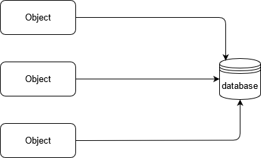
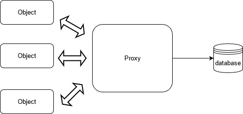
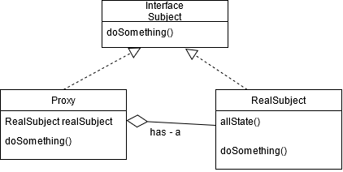
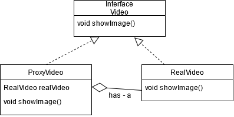

# Proxy Pattern

## Khái niệm

**Proxy** là Pattern thuộc nhóm cấu trúc, nó cung cấp các phương giúp giữ hoặc thay một đối tượng nào đó. Proxy sẽ kiểm soát tất các quyền truy cập tới đối tượng ban đầu, nó có thể chấp nhận lượt truy cập nào và lượt truy cập nào sau.

## Đặt vấn đề

Tại sao chúng ta cần phải kiểm soát lượt truy cập vào đối tượng (object) ? Giờ ví dụ bạn có một lớp (class) database và bạn cần nó hoạt động khi bạn gọi đến, nhưng không phải lúc nào cũng cần.



Bạn cần phải cài đặt lazy initialization: Có nghĩa là đối tượng (object) chỉ được khởi tạo khi tạ thực sự dùng đến nó. Điều này có nghĩa đối tượng nào cần sử dụng đến phương thức đó phải cái đặt khởi tạo trễ (lazy initialization), điều này làm đoạn code ấy lập đi lập lại nhiều lần.

## Giải Pháp

Bạn hãy khởi tạo một đối tượng (class) Proxy với interface giống với dịch vụ ban đầu (ở vị dụ là database). Sau đó bạn cập nhật lại các đối tượng trực tiếp sử dụng dịch vụ ban đầu, hướng chúng về lớp Proxy. Sau khi, khi Proxy nhận được các lời gọi từ các đối tượng, có bắt đầu khởi tạo dịch vụ ban đầu (database) và gọi lại các hàm sử lý dịch vụ.



Như vậy với vấn đề trên, bạn không cần phải implement lazy initialization lại nhiều lần, mà chỉ cần gọi thông qua lớp proxy

## Cấu Trúc



- **Subject**: là một interface định nghĩa các phương thức chung của Proxy và RealSubject.
- **Proxy**: Lớp Proxy duy trì tham chiếu đến RealSubject. Sau khi hoàn thành quá trình xử lý RealSubject (Khởi tạo, quản lý bộ nhớ,....), nó chuyển các yêu cầu đến RealSubject.
- **RealSubject**: lớp thực sự thực hiện các thao tác. Đây là đối tượng Proxy đại diện.
- **Client**: Đối tượng sử dụng RealSubject nhưng thông qua Proxy.

## Ví dụ áp dụng Decorator Pattern



Video.kt

```kotlin
interface Video {
    fun showVideo()
}
```

RealVideo.kt

```kotlin
class RealVideo : Video {

    var url : String

    constructor(url: String) {
        this.url = url
        println("Video loaded: ${this.url}")
    }


    override fun showVideo() {
        println("Video Showed: ${this.url}")
    }

}
```

ProxyVideo.kt

```kotlin
class ProxyVideo : Video {


    private var realVideo : RealVideo ? = null
    private var url: String

    constructor(url: String) {
        this.url = url
    }


    override fun showVideo() {
        if (realVideo == null) {
            realVideo = RealVideo(this.url)
        } else {
            println("Video already exits:${this.url}")
        }
        realVideo?.showVideo()
    }
}
```

main.kt

```kotlin
fun main(args: Array<String>) {
    var proxyVideo : ProxyVideo
    proxyVideo = ProxyVideo("hoclaptrinh.mp4")
    proxyVideo.showVideo()
    println()
    proxyVideo.showVideo()
}
```

Kết quả

```
Video loaded: hoclaptrinh.mp4
Video Showed: hoclaptrinh.mp4

Video already exits:hoclaptrinh.mp4
Video Showed: hoclaptrinh.mp4

Process finished with exit code 0

## 
```

## Khi nào áp dụng

Lazy initialization (virtual proxy).Khi bạn có một lớp rất nặng, mất rất nhiều tài nguyên khởi tạo và vận hành nó nhưng thỉnh thoảng bạn mới cần đến.

Accesss control (protection proxy). Khi bạn chỉ muốn các đội tượng đặc biệt sử dụng dịch vụ một đối tượng nào đó,

Điều khiển một dịch vụ từ xa (remote proxy). Đây là khi đối tượng dịch vụ đặt trên server ở xa.

Logging requests (Logging proxy). Khi bạn muốn lưu lại các request của đối tượng.

Caching request results (caching proxy). Lưu trữ kết quả request và quản lý vòng đời của bộ nhớ.


